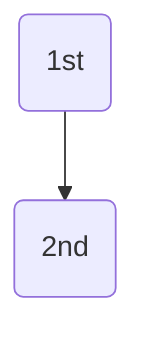
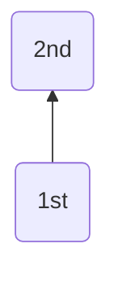
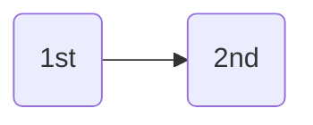
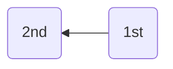
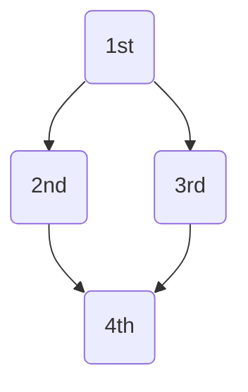

## VSCodeでMermaidを利用する方法や便利な拡張機能
##### Mermaidとは、コードベースでガントチャートやフロー図などの作成が可能となるライブラリです。
2022年にGitHubやQiitaでもサポートが開始し、Markdownに専用のコードを書くことで図の挿入が出来るようになりました。

では、VSCodeでMermaidを使ってフローチャートを書いてみましょう！

#### チャートの向きの変え方
##### TD(Top-Down)
上から下へ
```
graph TD;
    A(1st)-->B(2nd);
```

##### TB(Top to Bottom)
上から下へ（上記と同様）
```
graph TB;
    A(1st)-->B(2nd);
```

##### BT(Bottm to Top)
下から上へ（用途は少ない…）
```
graph BT;
    A(1st)-->B(2nd);
```

##### LR(left to right)
左から右へ
```
graph LR;
    A(1st)-->B(2nd);
```

##### RL(Right to Left)
右から左へ
```
graph RL;
    A(1st)-->B(2nd);
```



```
graph TD;
    A(1st)-->B(2nd);
    A(1st)-->C(3rd);
    B(2nd)-->D(4th);
    C(3rd)-->D(4th);
```

