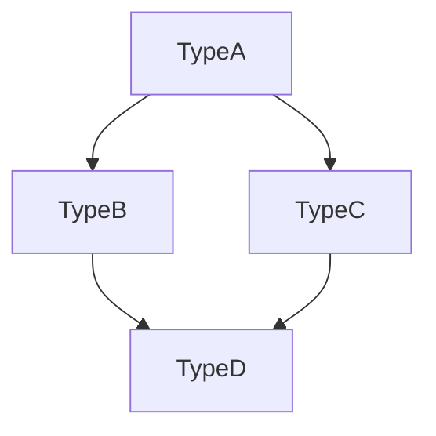

## VSCodeでmermaidを利用する方法や便利な拡張機能
1. 利用する方法
```graph TD;
    TypeA-->TypeB;
    TypeA-->TypeC;
    TypeB-->TypeD;
    TypeC-->TypeD;
```
上記のようなコードを書きます。

実際に、mermaid記法で図を出してみようと思います。

mermaid記法の図の出し方は、上記のコードに"mermaid"と書くと、上のような図が出てきます。これがmermaid記法の使い方です。
2. 便利な拡張機能
今回は3つ程拡張機能を紹介しようと思います。
１,Mermaid Diagrams (mermaid) by Markdown Preview Enhanced
この拡張機能は、この拡張機能は、Mermaidを使用して作成したダイアグラムをMarkdownファイル内でプレビューする機能を提供します。Markdownファイル内でMermaidコードを記述し、プレビューを表示すると、自動的にダイアグラムが表示されます。
２,Paste Image (Mushan) by Jun Han
この拡張機能は,クリップボードにある画像を簡単にVSCodeに貼り付ける機能を提供します。Mermaidのプレビュー画像をエクスポートし、クリップボードにコピーした後、この拡張機能を使用してVSCodeに貼り付けることができます。
３.Mermaid Preview (bierner):
 この拡張機能は、Mermaidコードをリアルタイムでプレビューする機能を提供します。Mermaidファイルを開いたままで作業すると、変更が自動的にプレビューに反映されます。