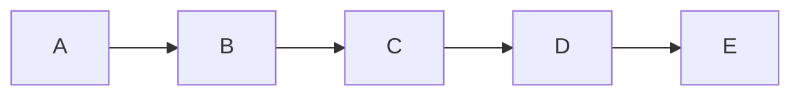
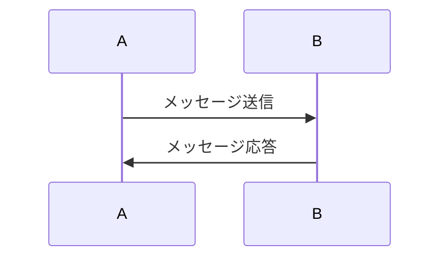
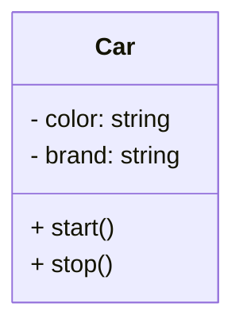
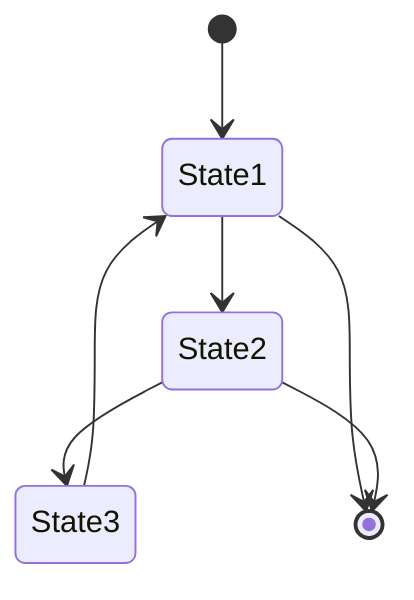
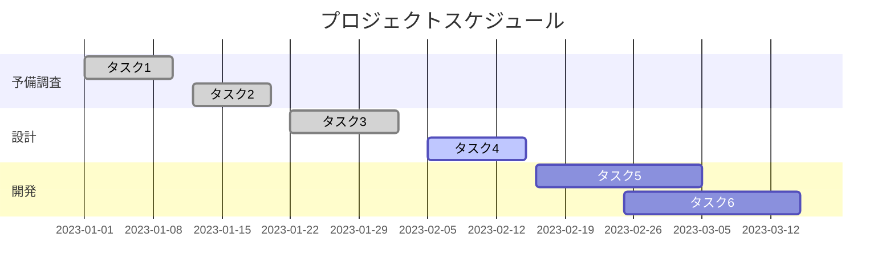

## mermaidで記述できるダイアグラムの記述例とコード
今回は、mermaidを使って作れるダイアグラムを紹介します。
#### 目次
```
1. フローチャート
2. シーケンス図
3. クラス図
4.　ステートマシン図
5. ガントチャート
```
##  フローチャート
フローチャートは、各プロセスを箱で表し、流れを矢印で表すことで、アルゴリズムやプロセスを表現する図です。アルゴリズムやプロセスについて、順序だけを示すものであり、全体から詳細のような「段階的」な説明ではない。また、データフロー図と対比すると、より重要であるデータの流れをフローチャートでは表すことがなく、操作を順に示すことでデータの流れを暗示する。しかし、フローチャートは様々な分野の工程の解析・設計・文書化・管理に用いられています。

実際にコードを書いてみます。
```
graph LR
    A --> B
    B --> C
    C --> D
    D --> E
```

## シーケンス図
シーケンス図とは、オブジェクト間の相互作用やメッセージの流れを時間の経過とともに示すための図です。主にソフトウェア開発やシステム設計の分野で使用され、システムの振る舞いやプロセスの流れを視覚的に表現するために利用されます。

実際にコード書いて紹介します。
```
sequenceDiagram
    participant A
    participant B
    A->>B: メッセージ送信
    B->>A: メッセージ応答
```

## クラス図
統一モデリング言語におけるクラス図とは、クラス、属性、クラス間の関係からシステムの構造を記述する静的な構造図です。

実際にコード書いて紹介します。
```
classDiagram
    class Car {
        - color: string
        - brand: string
        + start()
        + stop()
    }
```

##　ステートマシン図
ステートマシン図（じょうたいせんいず、State Transition Diagram）は、有限オートマトンなどの状態機械について、その各状態を頂点とし、状態から状態への各遷移を辺としたグラフ構造に注目して、グラフィカルに表現した図です。他の表現手法として状態遷移表などがあります。
ステートマシン図にはいくつかの異なる形式のものがあり、対象の性質や用途などによって使い分けることもあります。

実際にコードを書いて紹介します。
```
stateDiagram
    [*] --> State1
    State1 --> State2
    State1 --> [*]
    State2 --> State3
    State2 --> [*]
    State3 --> State1
```

## ガントチャート
ガントチャートとは、プロジェクト管理や生産管理などで工程管理に用いられる表の一種で、作業計画を視覚的に表現するために用いられています。棒グラフの一種でもあり、横棒によって作業の進捗状況を表します。

実際にコードを書いて紹介します。
```
gantt
    title プロジェクトスケジュール
    dateFormat  YYYY-MM-DD
    section 予備調査
    タスク1: done, 2023-01-01, 2023-01-10
    タスク2: done, 2023-01-12, 2023-01-20
    section 設計
    タスク3: done, 2023-01-22, 2023-02-02
    タスク4: active, 2023-02-05, 2023-02-15
    section 開発
    タスク5: 2023-02-16, 2023-03-05
    タスク6: 2023-02-25, 2023-03-15
```
