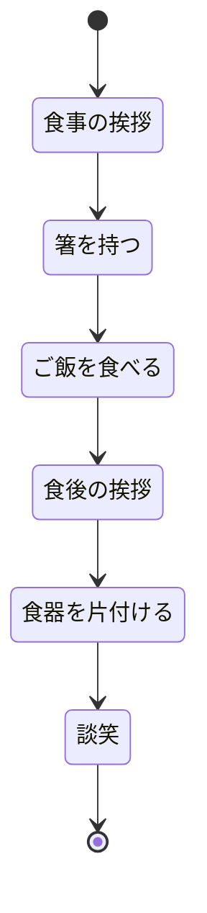

## Mermaidで記述できるダイアグラムのチュートリアル
ここでは、ダイアグラムのステートマシン図についての説明を記述していきたいと思います。

### 目次
```
1.ステートマシン図の作成方法
2.ステートマシン図の説明
3.実際にステートマシン図を作る
4.最後に
```

### 1.ステートマシン図の作成方法
ここでは、ステートマシン図を作成するために以下のMermaidを記述していきます。
```
stateDiagram-v2
    [*] --> 初期状態
    初期 --> 変化1
    変化1 --> 変化2
    変化2 --> [*]
```
上記は、初期状態からスタートし、変化１から変化２への遷移があります。また、この記号[*]は終了することを示しています。

### 2. ステートマシン図の説明
ステートマシン図は、オブジェクトやシステムの振る舞いや状態の遷移を視覚的に表現するための図です。主にソフトウェアやシステムの設計、ワークフローのモデリング、プロセスの可視化などに使用されます。

### 3. 実際にステートマシン図を作る
実際に食事を行う動作をステートマシン図で作ってみます。
```
stateDiagram-v2
    [*] --> 食事の挨拶
    食事の挨拶 --> 箸を持つ
    箸を持つ --> ご飯を食べる
    ご飯を食べる --> 食後の挨拶
    食後の挨拶 --> 食器を片付ける
    食器を片付ける --> 談笑
    談笑 -->  [*]
```    
これをマーメイドで出していきます。


### 4.最後に
このチュートリアルでは、Mermaidを使用してステートマシン図を紹介しました。ステートマシン図はオブジェクトやシステムの振る舞いや状態遷移を視覚的に表現するための図です。

作成手順としては、以下のように記載しました。

1. Mermaidのテキストベースの記法を使用してステートマシン図を作成します。
2. ステートマシン図は、初期状態や各状態、遷移を表す要素から構成されます。
3. 実際に社会人の一日をステートマシン図で表現する例を作成しました。

Mermaidを使用することで、簡潔な記法でステートマシン図を作成することができます。さまざまなシナリオやプロセスの振る舞いを視覚化し、理解しやすくすることができます。