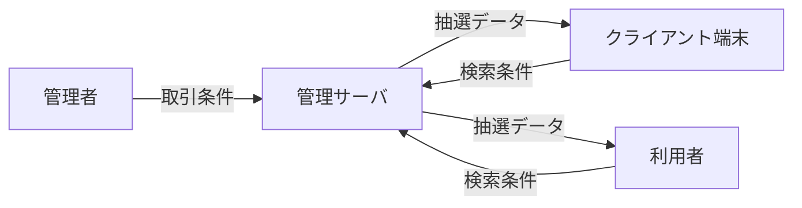

# システム全体図

```mermaid
graph LR;
    管理サーバ-->|抽選データ|クライアント端末;
    クライアント端末-->|検索条件|管理サーバ;
    管理サーバ-->|抽選データ|利用者;
    利用者-->|検索条件|管理サーバ;
    管理者-->|取引条件|管理サーバ
```

利用者条件
・初めて利用する場合は、ユーザ登録をする
・ブラウザでログインします。
・ブラウザを利用して、条件を入力して、検索する

管理者操作
・ブラウザよりログインして利用
・ブラウザより企業情報を登録・保守を行うデータベースを保管する。